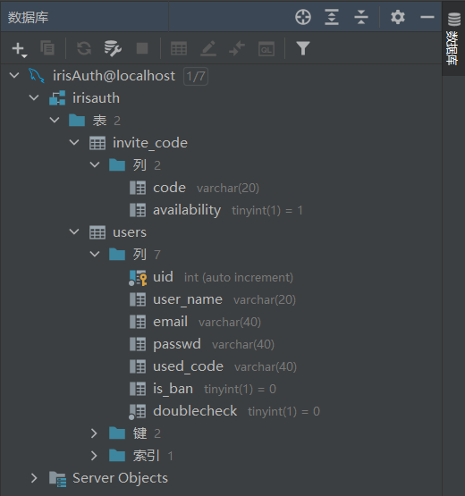

# IrisAuth: A Cross-domain SSO Service with Go Iris

NOTICE: The original repository in https://github.com/hedgehog-qd/IrisAuth is moved there. The original one will no longer be updated.

NOTICE: Please don't try this directly in production environment unless adding on encrypting functions in login.html, register.html.

This work is done with Go Iris and AdminLTE-3.2.0

This project offers a way of cross-domian SSO service which we use to build a common-used login service. With a registration on
this website, and just add on 1 more double check route in any other websites or services even with different domains, it would
be easier for users to do the authorization.

## How to use
- Put this app on your server
- Register a subdomain (like auth.yourdomain.com)
- Set up the proxy rules on your web server's config
- Create a database as following picture shows

- Set up the config of IrisAuth app
- Add an encrypting function in login.html and register.html for passwords

That's it.

## Demo
There is a demo we made using the Python Flask. It is in the 'demo' folder. We showed how to use this authorization app in other
websites or services by changing the `login()` function and add the `doublecheck()` function as shown in the */demo/app.py*

## Tips
You may need to edit the ports, and the URLs to let it fit your needs

